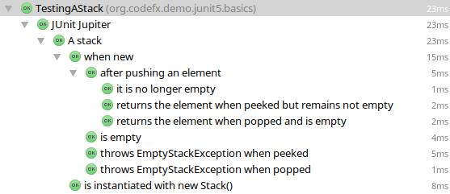

# JUnit 5 - An Early Test Drive - Part 2

###### Reference

[https://www.infoq.com/articles/JUnit-5-Early-Test-Drive-Part-2]()

## Shiny New Features

We've seen JUnit's new architecture, how to set it up considering current tool support, and which improvements the API we write tests against underwent. Let's now turn to the new features it brings to the table.

### Nesting Tests

JUnit Jupiter makes it near effortless to nest test classes, which allows you to organize tests within a class into BDD style groups. Just annotate the inner classes with `@Nested`:

```
class NestedTest {

    int count = Integer.MIN_VALUE;

    @BeforeEach
    void setCountToZero() {
   	 count = 0;
    }

    @Test
    void countIsZero() {
   	 assertEquals(0, count);
    }

    @Nested
    class CountGreaterZero {

   	 @BeforeEach
   	 void increaseCount() {
   		 count++;
   	 }

   	 @Test
   	 void countIsGreaterZero() {
   		 assertTrue(count > 0);
   	 }

   	 @Nested
   	 class CountMuchGreaterZero {

   		 @BeforeEach
   		 void increaseCount() {
   			 count += Integer.MAX_VALUE / 2;
   		 }

   		 @Test
   		 void countIsLarge() {
   			 assertTrue(count > Integer.MAX_VALUE / 2);
   		 }
   	 }
   }
 }
```

The lifecycle methods `@BeforeEach` and `@AfterEach` work here as well and are executed outside-in. This allows for incrementally building a context for the inner tests.

To make full use of this setup it is important that the nested classes have access to the outer test class’s fields. This only works if the nested classes are not static, which is hence a requirement. Since this prohibits the use of static methods, `@BeforeAll` and `@AfterAll` can not be used here.

We’ll see how the nested results are displayed right after we introduce another new feature, which cooperates extremely well with `@Nested`.

### Naming Tests

Developers often try to give tests names that express its prerequisites, the tested unit, and even the expected behavior. Fitting this into a method name quickly becomes unwieldy.

JUnit comes with a possible solution for that problem. The new annotation `@DisplayName` accepts an arbitrary string, which JUnit uses as a display name for the class or method. An example often given by the JUnit team is the following:

```
@DisplayName("A stack")
class TestingAStack {

	@Test
	@DisplayName("is instantiated with new Stack()")
	void isInstantiatedWithNew() { /*...*/ }

	@Nested
	@DisplayName("when new")
	class WhenNew {

    	@Test
    	@DisplayName("is empty")
    	void isEmpty() { /*...*/ }

    	@Test
    	@DisplayName("throws EmptyStackException when popped")
    	void throwsExceptionWhenPopped() { /*...*/ }

    	@Test
    	@DisplayName("throws EmptyStackException when peeked")
    	void throwsExceptionWhenPeeked() { /*...*/ }

    	@Nested
    	@DisplayName("after pushing an element")
    	class AfterPushing {

        	@Test
        	@DisplayName("it is no longer empty")
        	void isEmpty() { /*...*/ }

        	@Test
        	@DisplayName("returns the element when popped and is empty")
        	void returnElementWhenPopped() { /*...*/ }

        	@Test
        	@DisplayName(
                	"returns the element when peeked but remains not empty")
        	void returnElementWhenPeeked(){ /*...*/ }
	}

}
```

Together, `@Nested` and `@DisplayName`, create nicely readable output and should bring joy to the hearts of BDD‘ers!



### Parameter Injection

In the olden days test methods were not allowed to have parameters. That made sense then, because after all, what could JUnit possible pass for them? For version 5 the team answered this question with “Whatever you want!”.

So now test methods can have parameters. For each parameter, JUnit will search for an extension to provide a value. Two such extensions are built in, and they can be used to inject a TestInfo or a TestReporter, but neither is terribly useful for everyday test writing.

More interesting is the `MockitoExtension`, which will inject a mock into each parameter that is annotated with `@InjectMock`. It demonstrates how the extension API, although still a work in progress, can already be put to good use.

So let’s look at it!

## Extensibility

The JUnit Lambda project has a couple of core principles, one of them is to “prefer extension points over features”. This is a great principle to have and it looks like JUnit 5 will implement it well.

### Custom Annotations

All JUnit annotations can be used as meta-annotations, i.e. they can annotate other annotations. The Jupiter engine anticipates this and accepts such meta-annotations as if they were directly present on the respective element.

With this, we can easily create custom annotations that are fully functional within JUnit Jupiter:

```
/**
 * We define a custom annotation @IntegrationTest that:
 * - stands in for '@Test' so that the method gets executed
 * - has the tag "integration" so we can filter by that,
 *   e.g. when running tests from the command line
 */
@Target({ElementType.TYPE, ElementType.METHOD})
@Retention(RetentionPolicy.RUNTIME)
@Test
@Tag("integration")
public @interface IntegrationTest { }
```

We can then use it like this:

```
@IntegrationTest
void runsWithCustomAnnotation() {
    // this is run even though `@IntegrationTest` is not defined by JUnit
}
```

Neat! A simple but thoughtful feature with great implications for extensibility.


### Extension Points

JUnit defines specific points that extensions can use to inject their behavior. Let’s look at the currently defined ones:

#### **TestInstancePostProcessor**

Is called with the freshly instantiated test instance so that it can change its state, e.g. by injecting mocks.

#### **TestExecutionCondition, ContainerExecutionCondition**

Can evaluate a condition whose outcome determines whether the tests are executed. An example would be to only run tests on specific operating systems or when some external resource is available.

#### **BeforeAll, BeforeEach, AfterEach, AfterAll**

These extension points correspond to the setup and teardown methods that we discussed earlier and are called accordingly. One use case might be to initialize an external service before a test and shut it down afterwards.

#### **BeforeTestExecution, AfterTestExecution**

Are called immediately before and after a test is executed.

#### **ParameterResolver**

Corresponds to the parameter injection that we discussed above and can be used to resolve specific parameters. This can be used to easily inject mocks or services into tests.

#### **TestExecutionExceptionHandler**

This point gets called when a test resulted in an exception. It might be used to roll back a database transaction in case of an error or swallow expected exceptions.

There is one interface for each of these extension points. Each defines methods that the Jupiter engine calls at the appropriate time with the context corresponding to that point (like the test instance, the test method, the parameter, the present annotations, etc.). An extension can now chose to implement one or more of these interfaces and thus implement the feature it provides.

To actually apply an extension, the test class or method has to be annotated with `@ExtendWith(OurNewExtension.class)`.

Let’s look at two examples to get a feeling for how this works. If you are interested to see more, check out Rüdiger Herrmann’s post, experimenting with how to replace rules in JUnit 5.


### Conditions

#### @Disabled

We already saw that the `@Disabled` annotation simply disables a test. Let’s see how.

A class `DisabledCondition` implements both `TestExecutionCondition` and `ContainerExecutionCondition`. The corresponding methods get called with a context that can be used to check whether the `@Disabled` annotation is present. If so, the methods return a value that indicates that the test is disabled.

In code:

```
@Override
public ConditionEvaluationResult evaluate(
        ContainerExtensionContext context) {
    return evaluate(context.getElement());
}

@Override
public ConditionEvaluationResult evaluate(
        TestExtensionContext context) {
    return evaluate(context.getElement());
}

private ConditionEvaluationResult evaluate(
        Optional<AnnotatedElement> element) {
    Optional<Disabled> disabled =
            findAnnotation(element, Disabled.class);
    if (disabled.isPresent()) {
   	 String reason = /* … */;
   	 return ConditionEvaluationResult.disabled(reason);
    }
    return ENABLED;
}
```

Now we know that `DisabledCondition` is the extension responsible for actually implementing the behavior intended by `@Disabled`. But why in this case do we not have to use `@ExtendWith(DisabledCondition.class)` to disable tests?

Besides that annotation there is also an extension registry and it contains the built-in extension to reduce overhead. Although there would be another, slightly devious way to do this. We’ll use it right now for our own condition annotation.


#### @Available

Let’s assume we had an integration test that depended on some REST service being currently available. To disable such tests when the endpoint is down, we create an annotation `@Available` that takes a string as a value, so we can use it as follows:

```
@Test
@Available(“https://www.appdynamics.com”)
void testAuthorSearch() {
    // the test
}
```

Next we create the class `AvailableCondition` that looks very similar to the above. It implements the same interfaces (so we can use the annotation on test classes as well as on individual methods) and also forwards both method calls to a private `evaluate` method that only needs the annotated element.

If the annotation is present, it gets the URL and makes a tentative call. The test is only enabled if the response is acceptable.

Now all we have to do is tell JUnit about our `AvailableCondition` class. We could annotate all such tests with `@ExtendWith(AvailableCondition.class`) but that would be tedious. So let’s see the trick I promised. Remember meta-annotations and how JUnit looks for them? We can use that here and annotate `@Available` with our extension. JUnit will then discover and immediately apply it:

```
@Retention(RetentionPolicy.RUNTIME)
@ExtendWith(AvailableCondition.class)
public @interface Available {
    String value();
}
```

I like it.

#### Injection

Let’s go back to the [MockitoExtension](https://github.com/junit-team/junit5-samples/tree/r5.0.0-M2/junit5-mockito-extension), which we mentioned above, and see how it works. It implements `ParameterResolver`, which defines two methods:

* The first is `supports` and is used to check whether the resolver supports the parameter.
* The second is `resolve` and has to return the instance that will be injected.

It sounds reasonable to only inject values into parameters that were annotated, so let’s implement that:

```
@Override
public boolean supports(
        ParameterContext parameterContext,
        ExtensionContext extensionContext) {
    return parameterContext
                .getParameter()
                .isAnnotationPresent(InjectMock.class);
}
```

Creating the mock with Mockito is easy as pie:

```
@Override
public Object resolve(
        ParameterContext parameterContext,
        ExtensionContext extensionContext) {
    Class<?> parameterType = parameterContext().getParameter().getType();
    return Mockito.mock(parameterType);
}
```

(The actual implementation is a little more involved because it allows setting up mocks in lifecycle methods, which means it has to track mocked instances instead of always creating a new one. But this is essentially the pattern.)

We can use a similar approach if we want to inject configured services or other non-trivial objects into our tests.

## Summary

And so our deep dive into JUnit 5 comes to an end. Let’s resurface slowly.

We have seen how the problematic extensibility and lacking modularity of JUnit 4 required a complete rewrite for JUnit to move forward. In 2015 a team of seasoned developers gathered around the idea of a coordinated effort. Sponsored by their employers and the crowd they invested a couple of months and came out with a prototype, an alpha version, and recently Milestones 1 and 2.

Its architecture differentiates between “**JUnit the platform**” and “**JUnit the tool**”. To satisfy the former, **JUnit Platform** was created, a launcher that orchestrates different engines. For now there are engine implementations for **JUnit 4 (JUnit Vintage)** and 5 but in the future all kinds of testing frameworks might provide their own. Each engine runs the tests that were written against its specific API. At this end of the spectrum is **JUnit Jupiter**, “JUnit the tool”, which we developers use to write tests against and which consists of just a slim JAR containing only the API.

JUnit 4’s rivalling approaches to extensibility, namely Runners and Rules, were replaced by extension points. Such points exists for many steps in JUnit Jupiter’s lifecycle, starting with test instance creation all the way to conditional execution and exception handling.

Above that radical new architecture and extension model is a layer of shiny new features: tests can easily be named and nested and have their parameters injected. Close to the surface the waters get calmer. Jupiter is content with package-visible classes and methods, slightly renames lifecycle annotations, and incrementally improves assertions and assumptions.

A superficial glance might not even spot the difference between the two versions.

So what happens next? We should check out Milestone 2 with our code base in mind and think about the aspects that might not translate easily. These cases are of special interest to the JUnit team!

They, in turn, continue to improve the project. The biggest issue they have recently finished is dynamic test generation, which allows the creation of tests at runtime and might unlock the much-coveted lambda tests. The plan is to release another milestone or maybe even a final version later this year.

I can hardly wait!